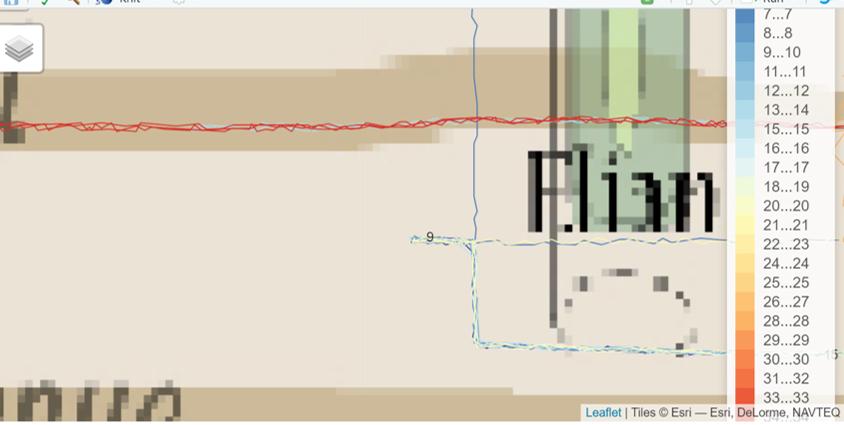
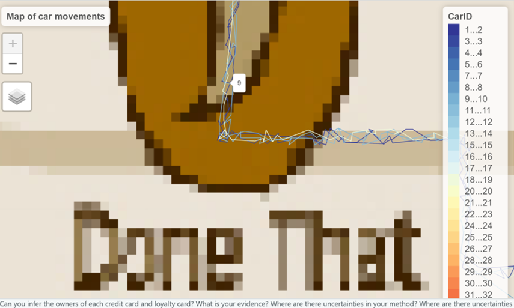

```{r setup, include=FALSE}
options(htmltools.dir.version = FALSE)
knitr::opts_chunk$set(echo = TRUE,
                      eval = TRUE,
                      fig.retina = 3,
                      message = FALSE,
                      warning = FALSE)
```


```{r}
packages = c('DT','ggiraph','plotly','tidyverse', 'raster','sf','clock','tmap',
             'rgdal','dplyr', 'tidyr', 'textclean', "plotly", "forcats", "jpeg", "tiff",
             "mapview","tidygraph","igraph","ggraph","visNetwork","leaflet","lubridate")
for(p in packages){
  if(!require(p,character.only = T)){
    install.packages(p)
  }
  library(p,character.only = T)
}
```


```{r}
car <- read_csv("data/mc2/car-assignments.csv")
cc <- read_csv("data/mc2/cc_data.csv", locale = locale(encoding = "ASCII"))
gps <- read_csv("data/mc2/gps.csv")
loyalty <- read_csv("data/mc2/loyalty_data.csv",locale = locale(encoding = "ASCII"))
```


## 2.6. Data Preparation

### 2.6.1 CC and Loyalty dataset

We will prepare the cc and loyalty datasets for data exploration later.

#### 2.6.1.1. Changing the datatypes of last4ccnum & loyaltynum

The last4ccnum of the cc datasets and the loyaltynum of the loyalty dataset should be a categorical data type. As such, we will change it by using the *as.factor* function. 


```{r}
cc$last4ccnum <- as.factor(cc$last4ccnum)
loyalty$loyaltynum <- as.factor(loyalty$loyaltynum)
```

Next, we will modify the datatype for both the timestamp of cc and loyalty dataset using the *clock* package. If we observe below, the data_time_parse function is use to change the timestamp to *dttm* (datetime) format while the date_parse function is used to change the data to *date* format.


```{r}
cc$timestamp <- date_time_parse(cc$timestamp,
                                 zone = "",
                                 format = "%m/%d/%Y %H:%M")

loyalty$timestamp <- date_parse(loyalty$timestamp,
                                 format = "%m/%d/%Y")

```


We will double check the dataset to confirm that the datatype has been changed to the one we wanted.


```{r}
glimpse(cc)
glimpse(loyalty)

```

#### 2.6.1.2 Splitting the timestamp data into individual date, time and day columns.

To allow us to dive deeper into our analysis later, we will split the timestamp dataset into date, time and day columns. We will first add more columns by using the *mutate* function from dplyr to add day, date and time columns in the cc dataset and importing in to the *cc_dtsplit* object.

There is no need to add columns for the loyatly dataset as we will join both the datasets together in which day will be included in the joined dataset.

```{r}
cc_dtsplit <- cc %>%
  mutate(day = date_weekday_factor(cc$timestamp), date =  as_date(cc$timestamp), time = format(cc$timestamp, format = "%H:%M"))

cc_dtsplit

```

To allow us to join both datasets together, we will need to rename the timestamp column from the loyatly dataset to *date* so that both the date columns have the same name.


```{r}
loyalty_dt <- rename(loyalty, date = timestamp)

```

```{r}
gps_cleaned <- rename(gps,CarID = id)

gps_cleaned$Timestamp <- date_time_parse(gps_cleaned$Timestamp,
                                 zone = "",
                                 format = "%m/%d/%Y %H:%M")

```

# 4. Answers

### 4.1.  Using just the credit and loyalty card data, identify the most popular locations, and when they are popular. What anomalies do you see? What corrections would you recommend to correct these anomalies? Please limit your answer to 8 images and 300 words.


As shown previosuly in our data preparation segment, there is a difference in rows (difference of 98 rows) between the cc and loyalty card data. This shows an anomaly that one of the cards were used but not both during purchases which might results in a difference in number of entries.


```{r}

glimpse(cc_dtsplit)
glimpse(loyalty_dt)
```

As explained previously, the cc and loyalty dataset are similar in nature with just an exception of the last4ccnum and loyaltynum, therefore, a join is required to match rows where the users uses both cc and loyalty card data. However, before a join is performed, we will analyse both the cc and loyalty dataset based on location counts.


A first exploratory data analysis by using a bar chart is performed on the cc_dtsplit dataset to find out the location which were patronize the most. 

Based on the bar chart below, we are able to observe that there are 4 locations that are siginificantly higher in visitors than the rest of the locations. The highest is Katerina's cafe with a total of 212 visits followed by Hippokampos, Guys'Gyros and Brew's been served. These four places excluding Hippokampos which is not determinable in the map provided are all restaurants/bars.


```{r}
cc_dtsplit_bar <- cc_dtsplit %>%
  count(location) %>%
  mutate(location = fct_reorder(location, n, .desc =TRUE)) %>%
  plot_ly(x = ~location, y = ~n, marker = list(color = ~n)) %>%
  add_bars() %>%
  layout(title = "Total number of visitation by location", xaxis = list(title = ""),yaxis = list(title = "Number of visitors"))

cc_dtsplit_bar
```


Next, we will take a look at the loyalty_dt dataset.

Based on the bar chart below, we are able to observe that the 4 locations that were visited mostly are the same four locations that was shown on the cc_dtsplit dataset.

One difference is that *Ouzeri Elian* jumps to the fifth spot which differs from the cc_dtsplit dataset where *Ouzeri Elian* is in the sixth spot.


```{r}
loyalty_dt_bar <- loyalty_dt %>%
  count(location) %>%
  mutate(location = fct_reorder(location, n, .desc =TRUE)) %>%
  plot_ly(x = ~location, y = ~n, marker = list(color = ~n)) %>%
  add_bars() %>%
  layout(title = "Total number of visitation by ", xaxis = list(title = ""),yaxis = list(title = "Number of visitors"))

loyalty_dt_bar
```


Next, an inner join will be conducted by joining date, location and price and will will output into a new object *cc_loyalty_join*.

Notice that there are only 1,087 rows wheareas both cc_dtsplit and loyalty_dt has 1490 and 1392 rows respectfully. These shows that some of the data in cc does not match the loyalty data which strengthens the initial anomaly that some of the employees uses one of each card but not both during purchases.


```{r}
cc_loyalty_join <- cc_dtsplit %>%
  inner_join(loyalty_dt, by = c("date","location", "price"))

cc_loyalty_join
```


### 4.3. Can you infer the owners of each credit card and loyalty card? What is your evidence? Where are there uncertainties in your method? Where are there uncertainties in the data? Please limit your answer to 8 images and 500 words.

To infer the cc and loyalty card data to the CarID, we will need to use the movement data using the geospatial data that was provided. We will first take a look at the tourist map in jpg form. Notice that there are some locations that were provided in the cc and loyalty dataset but not detectable in the tourist map. As such, there are some discrepancies in the map given. 


Next, the jpg file provided does not have any movement data projected into it. As such, we will need to use an additional software to import the movement data into the map. The software to allow us to import the movement data into the map is QGIS georeferencing software. The end product is as shown below.


Next, we will read the Tag Image File (TIF) that we have created into RStudio via the function raster. Raster is a package to read, write and manipulate spatial data into R.
 

```{r}
map <- raster("data/MC2/MC2-tourist_modified.tif")

map


```

Next, we will output the raster layer using tm_shape. 


```{r}
tm_shape(map) +
tm_rgb(map, r = 1,g = 2,b = 3,
alpha = NA,
saturation = 1,
interpolate = TRUE,
max.value = 255)

```

Next, we will import the GIS data layer in the ESRI shapefile format.


```{r}
Abila_st <- st_read(dsn = "data/MC2/Geospatial",
layer = "Abila")


```

Next, we will create a day factor, e.g. 2014-01-06 will be day 6. This will us to filter the day more easily when we analyse the car movement later. 


```{r}
gps_cleaned$day <- as.factor(get_day(gps_cleaned$Timestamp))

gps_cleaned

```

Converting aspatial data into simple feature data frame.


```{r}
gps_sf <- st_as_sf(gps_cleaned,
  coords = c("long", "lat"),
  crs= 4326)

gps_sf
```


Creation of movement path


```{r}
gps_path <- gps_sf %>%
group_by(CarID, day) %>%
summarize(m_Timestamp = mean(Timestamp),
do_union=FALSE) %>%
st_cast("LINESTRING")

gps_path
```

Before we plot the GPS path, we will need to remove the orphan lines which are represented by p = 1. 


```{r}
    p = npts(gps_path, by_feature = TRUE)
    gps_path2 <- cbind(gps_path, p)
                
    gps_path_revised <- gps_path2 %>%
      filter(p != 1)
    
    gps_path_revised

```


With the above prepared data. We are now ready to plot the GPS path into the map. First, we will filter the data by day == 10. To sieve out all those vehicle movements in day 10. 

Next, we will tmap to produce the map, afterwhich the tm_shape and tm_lines are use to plot the movement lines onto the map. Lastly, we will create some layout such as label and legend to differentiate the CarID. The geospatial map produced is interactive whereby user are able to hover their mouse to a line in which a tooltip of the CarID will show up.

Note that currently, there is no interative button or dropdown list for user to select the day or CarID they wanted. A shiny app will be required to perform this role. However, the shinyapp will not be shown this assignment.


```{r}
gps_path_selected <- gps_path_revised %>%
filter(day == 10)
gps_path_selected


tmap_mode("view")
m <- tm_shape(map) +
tm_rgb(map, r = 1,g = 2,b = 3,
alpha = NA,
saturation = 1,
interpolate = TRUE,
max.value = 255) +
tm_shape(gps_path_selected) +
tm_lines(col = "CarID",palette="-RdYlBu") +
  tm_text(text = "CarID") +
  tm_layout (title = "Map of car movements") 

lf <- tmap_leaflet(m)

lf2 <- leaflet(m) %>%
  addTiles(group = "CarID") %>%
  addLayersControl(baseGroups = c("CarID"))

lf


```


Next, we will show how to infer the CarID to the cc dataset.The process is as follows:

First, we will output the cc_loyalty_join dataset which is the joined cc and loyalty dataset. Next, we will filter to a random date such as 2014-01-10 as shown below. Taking reference to the location *Ouzeri Elian*. We can see that there are 6 instances on day 10.


```{r}
cc_loyalty_join %>%
  filter(date == "2014-01-10") %>%
  arrange(location) 

```


Now, we will head back to the map to record down all the CarID that was present at Ouzeri Elian. Notice that there were 6 CarIDs, 1,5,9,15,18,21. Note! 1) Not always will there be the same amount of CarIDs as the cc_loyalty_join dataset. However, the modality is still the same which is to record down all the CarIDs. 2) the lines might not always stop at the location itself which is the same as Ouzeri Elian as shown below. A tip is to find places there have a "U-turn" in which indicates the person stop at the place and left after that.




Next, we will filter the cc_loyalty_join dataset by the last4ccnum of the 6 CarIDs. For our example, we will use 1877. Notice that last4ccnum 1877 went to Bean there done that.

```{r}
cc_loyalty_join %>%
  filter(last4ccnum== 1877, date == "2014-01-10") %>%
  arrange(location) 

```

Now, we will head back to the map and hover our mouse to Bean there done that, we should be able to see CarID 9 pops up. The rest of the CarIDs do not match any of the CarIDs at Ouzeri Elian. As such CarID 9 corresponds to last4ccnum of 1877 and loyatlynum L3014.




This examination of both data sources does not always work as there are some discrepancies and limitation in using the map data such as the 1) the location is not accurate to the said location like Ouzeri Elian. 2) If on the day, the particular user went to only one place, however, there are a lot of CarIDs at the same location which will makes it difficult to detect the CarID. 3) There are places like Hippokampos which is not indicated in the map. 

Most of the above limitations and discrepancies can be resolve by trial and error on other days. Another tip is to create another map and filter by day and CarID to clearly see the movement of the car and whether does is match the cc dataset. However, there are still some CarIDs that are not able to be infered due to lack of good information or false information provided.

```{r}
gps_path_selected <- gps_path_revised %>%
filter(CarID == 9, day == 10)
tmap_mode("view")
tm_shape(map) +
tm_rgb(map, r = 1,g = 2,b = 3,
alpha = NA,
saturation = 1,
interpolate = TRUE,
max.value = 255) +
tm_shape(gps_path_selected) +
tm_lines()

```

### Tagging CarID to cc and loyalty dataset

Below is a dataframe that has been created to tag the CarID to the cc and loyalty datasets.

Notice that there are some user with multiple cc.

Those CarIDs that are not able to inferred are 20,23,24,28,32,102 & 103. Note that 102 and 103 are not tag with any cc dataset because there is no movement data provided for these two vehicles.

```{r}
car_cc <- data.frame("CarID" = c(1,1,1,2,3,4,4,5,5,6,7,8,8,9,10,10,11,12,13,13,13,14,14,14,15,15,16,16,17,18,18,18,18,19,21,22,22,
                                 25,25,25,26,26,27,29,29,29,30,30,30,30,31,33,34,35,101,101,104,105,106,106,107),"last4ccnum" = c(7108,9551,2681,1415,9635,8156,7688,6899,7117,7253,2540,5368,5368,1877,8332,8332,1321,7108,5407,8202,6691,7889,7889,1874,3853,8129,4795,4795,
  7384,9617,7354,4434,7792,6895,9405,1286,1286,6816,2418,2142,7819,1310,3492, 3547,5921,5921,8411,4948,4948,6901,5010,9683,3484,2463,9220,9220,8642,9152,2276,3506,4530), "loyaltynum" = c("L6544","L5777","L1107","L7783","L3191","L5224","L4164", "L6267","L6417","L1682","L5947", "L2247","L6119","L3014","L2070","L8566","L4149","L6544","L4034","L2343","L6267","L6119","L2247","L4424","L1485","L8328","L8566","L2070","L3800","L5553","L9254","L2169","L5756","L3366","L3259","L3288","L3572","L8148","L9018","L9637","L5259","L8012","L7814","L9362","L3295","L9406","L6110","L9406","L3295","L9363","L2459","L7291","L2490","L6886","L4063","L7761","L2769","L5485","L3317","L7761","L8477"))


car_cc$last4ccnum <- as.factor(car_cc$last4ccnum)
car_cc$loyaltynum <- as.factor(car_cc$loyaltynum)

car_cc
```


